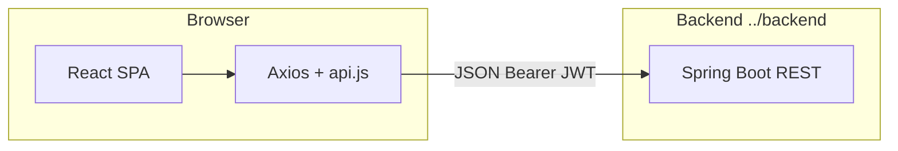

# YouMe — Frontend Project Specification

**Audience:** Developers, designers, and **customers** evaluating the web client: what users can do, which libraries are used, and how the UI connects to the API.

**Companion:** [README.md](./README.md). The API is documented under **`../backend/`**.

---

## 1. What the frontend delivers

| User-facing area | Description |
|------------------|-------------|
| **Auth** | Email/password login and registration; JWT stored in `localStorage`. |
| **Discover** | Swipe-style feed; like, pass, super-like; match overlay. |
| **Likes** | Send likes by user id; view activity list. |
| **Messages** | List matches; open chat per match; send/receive messages. |
| **Profile** | View/edit profile, premium toggle, logout; link to photos. |
| **Photos** | Presign → upload instructions → complete flow (depends on backend + storage). |

---

## 2. Role in the full system

---

## 3. Technology — *what it is for here*

| Technology | Role | Customer-friendly note |
|------------|------|-------------------------|
| **React 19** | Component UI for all screens | Widely adopted; large talent pool; component reuse. |
| **Vite 7** | Dev server, HMR, production bundle | Fast feedback while building; optimized static output. |
| **React Router 7** | Client-side routes (`/`, `/profile`, `/messages/:matchId`, …) | Shareable URLs and normal browser navigation. |
| **Axios** | HTTP client | Interceptors attach JWT and handle global 401 (except login/register). |
| **CSS + variables** (`index.css`, `App.css`) | Theming, layout, responsive rules | No mandatory UI kit—easy rebrand (colors, fonts). |
| **Noto Sans JP** (via `index.html`) | Typography | Readable Latin + Japanese in one stack. |

---

## 4. Routes and API usage

| Route | Page | Typical API calls |
|-------|------|-------------------|
| `/login` | `LoginPage` | `POST /auth/login` |
| `/register` | `RegisterPage` | `POST /auth/register` |
| `/` | `FeedPage` | `GET /feed`; like/dislike/superlike endpoints |
| `/likes` | `LikesPage` | `GET /likes`, `POST /likes/{id}` |
| `/messages` | `MatchesPage` | `GET /matches` |
| `/messages/:matchId` | `MessagesPage` | `GET/POST /matches/{id}/messages` |
| `/profile` | `ProfilePage` | `GET /me`, `PUT /me/profile`, `POST /me/upgrade` |
| `/photos` | `PhotosPage` | `POST /photos/presign`, `POST /photos/complete` |

Protected routes redirect to `/login` when there is no token (`App.jsx`).

---

## 5. Auth & HTTP (`api.js`)

- **Base URL:** `http://localhost:8090` by default—change for staging/production.
- **JWT:** Sent as `Authorization: Bearer <token>` for all requests **except** paths starting with `/auth/login` and `/auth/register`.
- **401:** Clears token and redirects to `/login` for non-auth requests (failed login still shows inline error).

---

## 6. Styling model

- **Design tokens** in `index.css` (`:root`): colors, radii, shadows, gradients (violet + sakura-accent palette).
- **Layout & components** in `App.css`: cards, buttons, bottom nav, feed stack, chat bubbles, match list.
- **Inline styles** in some pages for one-off layout (forms, grids).

Rebranding: adjust CSS variables first, then component-level rules.

---

## 7. Build output & hosting

- **`npm run build`** produces static assets in **`dist/`**.
- Host on S3+CloudFront, Netlify, Vercel, Nginx, etc.
- Configure API URL so the built app points at your deployed backend (and CORS on server matches your web origin).

---

## 8. Out of scope

- **Native iOS/Android apps** — not included; same API could power them later.
- **SSR / SEO** — client-rendered SPA; add a meta framework only if you need SEO for public marketing pages.
- **i18n** — UI strings are English in code; add `react-i18next` or similar for multi-language product copy.

---

## 9. Sales one-liner (web client)

> *A responsive React single-page app with discovery, matches, chat, and profile management—wired to a REST API with token-based login and ready to deploy as static files behind any CDN.*
